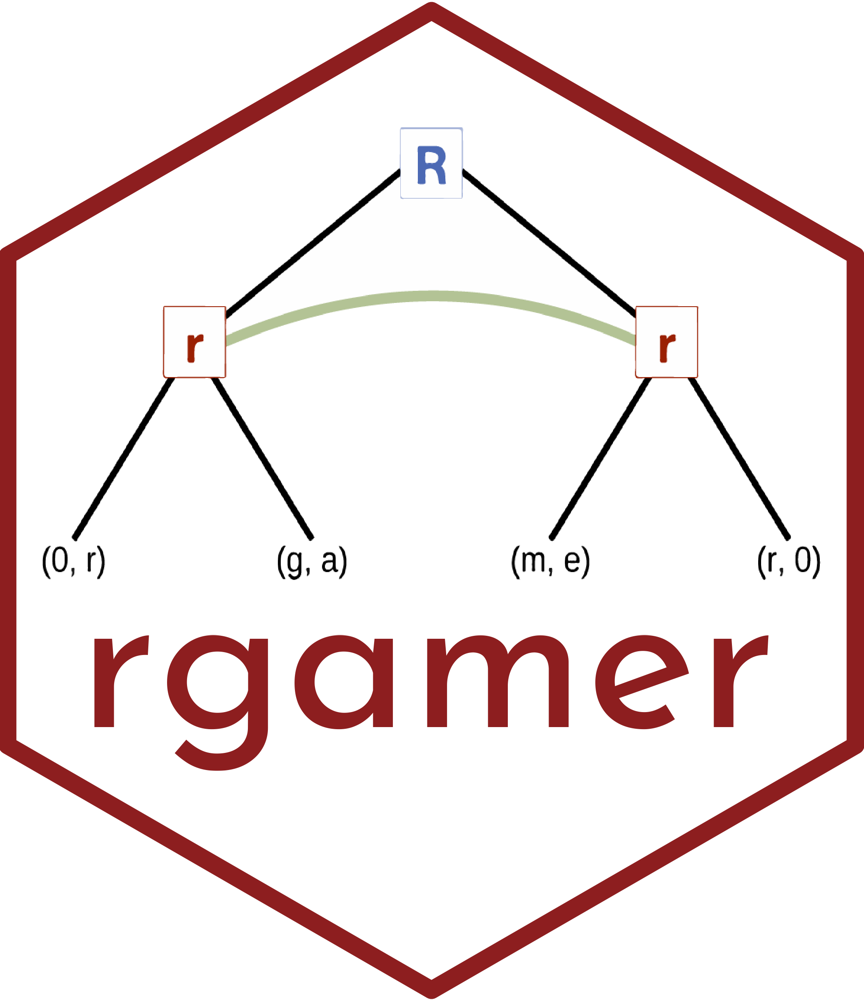

```{r setup, include=FALSE}
knitr::opts_chunk$set(message = FALSE, fig.align = 'center')
```


<br>

## rgamer とは

rgamer とは、教育・研究目的でゲーム理論を使用する人たちのために作られた R のパッケージである。
rgamer を使えば、ゲームを自動的に解析・可視化することが可能になる。
このサイトでは、rgamer の機能と使い方について簡単に紹介する。
詳細については、我々が執筆した「R で学ぶゲーム理論」か、あるいはパッケージの<a href="https://github.com/yukiyanai/rgamer">ヘルプページ</a>から確認してほしい。


```{r, echo=FALSE, out.width="50%", fig.align='center'}

```


<br>
<br>


## rgamer のインストール方法

`rgamer` を github からインストールするために、まずパッケージ `remotes` をインストールする。

```{r, eval = FALSE}
install.packages("remotes")
```

続けて、以下のコードを実行すれば `rgamer` がインストールできる。

```{r, eval = FALSE}
remotes::install_github("yukiyanai/rgamer")
```

<br>
<br>


## 使用方法

`rgamer` を利用するためには、まず `rgamer` を読み込む必要がある。

```{r, eval = TRUE}
library(rgamer)
```

これで `rgamer` を使用可能である。

<br>
<br>


## 標準形ゲーム

試しに、囚人のジレンマゲームを分析してみる。

<br>

### ゲームを定義

まずはゲーム（囚人のジレンマゲーム）を定義する。

```{r}
g1 <- normal_form(
  players = c("player 1", "player 2"), 
  s1 = c("C", "D"), 
  s2 = c("C", "D"),   
  payoffs1 =c(4, 5, 1, 2),
  payoffs2 =c(4, 1, 5, 2),
)
```

<br>


### 利得表を表示

```{r, results='asis'}
g1_sol <- solve_nfg(g1)
```

<br>

### NE を表示!

```{r}
g1_sol$psNE
```

<br>

### 混合戦略まで考えて最適反応を図示

```{r}
g1_sol$br_plot
```


## 展開形ゲーム

### ゲームの木を表示する

展開形ゲームを定義する方法はいくつか用意されている。
まずは簡単な方法を紹介する。
標準形ゲームで使用した囚人のジレンマゲームを、player 1 が先手、player 2 が後手として、プレイされる状況を考える。

```{r}
g2 <- seq_form(
  players = c("P1", "P2"), # c("player 1", "player 2"), だとBI でバグ発生 
  s1 = c("C", "D"), 
  s2 = c("C", "D"),   
  payoffs1 =c(4, 5, 1, 2),
  payoffs2 =c(4, 1, 5, 2),
)

g3 <- seq_extensive(g2)
```

ゲームの木の向きを右向きに変える。

```{r}
g3 <- seq_extensive(g2, direction = "right")
```


### バックワードインダクション

バックワードインダクションで戦略の組を求める。

```{r}
g3_sol <- solve_efg(g3)
g3_sol$trees
```

<br>

### より一般的な定義の仕方

展開形ゲームを定義する。

```{r}
g4 <- extensive_form(
  players = list("P", # n1
                 rep("R", 3), # n2 - n4
                 rep(NA, 6) # n5 - n10
  ),
  actions = list(c("(4, 0)", "(2, 2)","(0, 4)"), # n1: P
                 c("Y", "N"), ## n2: R
                 c("Y", "N"), ## n3: R
                 c("Y", "N")  ## n4: R
  ),
  payoffs = list(P = c(4, 0, 2, 0, 0, 0),
                 R = c(0, 0, 2, 0, 4, 0)),
  direction = "right",
  show_tree = FALSE,
)
```


ゲームの木を表示する。

```{r}
g4$tree
```


バックワードインダクションを実行する。

```{r}
g4_sol <- solve_efg(g4)

library(patchwork)
plot(g4_sol$trees[[1]] + g4_sol$trees[[2]])
```

これより、先手が利己的（自分に全部）な提案する場合も、先手が公平な提案をする場合も、どちらもあり得ることがわかる。

<br>

### 標準形への変換

先ほどの展開形ゲームを標準形に変換する。

```{r, results='asis'}
g4_m <- to_matrix(g4)
g4_m_sol <- solve_nfg(g4_m) 
```

当然、NE を求めることができる。

```{r}
g4_m_sol$psNE
```


<br>
<br>

## マッチング

### ボストン方式

```{r}
m_boston <- matching(
  g1_names = c("M1", "M2"),
  g1_prefs = list(c("W1", "W2", "W3"), 
                  c("W2", "W1", "W3")),
  g2_names = c("W1", "W2", "W3"),
  g2_prefs = list(c("M2", "M1"), 
                  c("M2", "M1"), 
                  c("M1", "M2")),
  algorithm = "Boston",
  switch = TRUE,
  verbose = TRUE
)

print(m_boston)
```


### DA 方式

```{r}

m_da <- matching(
  g1_names = c("M1", "M2"),
  g1_prefs = list(c("W1", "W2", "W3"), 
                  c("W2", "W1", "W3")),
  g2_names = c("W1", "W2", "W3"),
  g2_prefs = list(c("M2", "M1"), 
                  c("M2", "M1"), 
                  c("M1", "M2")),
  algorithm = "DA",
  switch = TRUE,
  verbose = TRUE
)
print(m_da)

```


### 安定性

```{r}
is_stable(m_boston)

is_stable(m_da)

```

つまり、今回の選好リストにおいては、DA 方式は安定な結果を返しているが、
ボストン方式の結果は安定ではない。
(W1, M1) がブロッキングペアである。


<br>
<br>

Enjoy with rgamer!!!

<br>
<br>
