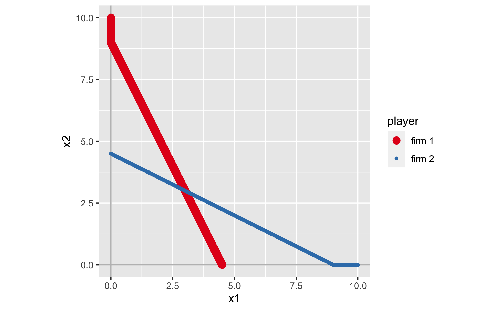

```{r setup, include=FALSE}
knitr::opts_chunk$set(message = FALSE, fig.align = 'center', out.width="80%", out.height="80%")

library(patchwork)
```


<br>

## 準備

```{r, eval = TRUE}
library(rgamer)
```


## 囚人のジレンマ

```{r}
g1 <- normal_form(
  players = c("player 1", "player 2"), 
  s1 = c("C", "D"), 
  s2 = c("C", "D"),   
  payoffs1 = c(4, 5, 1, 2),
  payoffs2 = c(4, 1, 5, 2),
)
```


### 利得表を表示

```{r, results='asis'}
g1_sol <- solve_nfg(g1)
```

<br>

### NE を表示

```{r}
g1_sol$psNE
```


<br>

### 考えてみよう

すべてのケースにおいて、player 1 の利得に + 10 をし、player 2 の利得に -5 をすると、NE は変わるのだろうか? 

この点を確かめてみる。

```{r}
g2 <- normal_form(
  players = c("player 1", "player 2"), 
  s1 = c("C", "D"), 
  s2 = c("C", "D"),   
  payoffs1 = c(4, 1, 5, 2) + 10, # R コードのルールにより、これですべてが + 10 される
  payoffs2 = c(4, 5, 1, 2) - 5,
)
```

当然、利得表は変化する。

```{r, results='asis'}
g2_sol <- solve_nfg(g2)
```

<br>

でも、NE は変わらない。
利得表を見比べれば分かることだが、今回のような利得の変換をしたとしても、
最適反応（キャレット ^ の場所）が変化しないため、NE は変わらないのである。

```{r}
g2_sol$psNE
```


<br>
<br>

## 鹿狩りゲーム

協力して鹿を狩るか、一人でウサギを狩るか。

```{r}
g1 <- normal_form(
  players = c("hunter 1", "hunter 2"), 
  s1 = c("S", "R"), 
  s2 = c("S", "R"),   
  payoffs1 = c(4, 1, 0, 1),
  payoffs2 = c(4, 0, 1, 1),
)
```


```{r, results='asis'}
g1_sol <- solve_nfg(g1)
```

このゲームでは、純粋戦略 NE が二つある。

```{r}
g1_sol$psNE
```

<br>

### 最適反応をプロット

混合戦略 NE があるか確認するため、最適反応を表示

```{r}
g1_sol$br_plot
```

両者ともに、確率 1/4 で鹿を狩りに行くような、混合戦略 NE が存在する。


<br>

### 考えてみよう

もし、鹿を狩ることに成功した時の利得が大きくなったら（例えばそれぞれ利得 9）、NE はどのように変わるだろうか。特に、混合戦略 NE で鹿を狩りに行く確率はどのように変化するだろうか? 

早速試してみよう。

```{r}
g2 <- normal_form(
  players = c("hunter 1", "hunter 2"), 
  s1 = c("S", "R"), 
  s2 = c("S", "R"),   
  payoffs1 = c(9, 1, 0, 1), # 利得を修正
  payoffs2 = c(9, 0, 1, 1), # 利得を修正
)
```


```{r, results='asis'}
g2_sol <- solve_nfg(g2)
```

純粋戦略 NE が二つあることは変わらない。

```{r}
g2_sol$psNE
```

<br>

最適反応を表示すると

```{r}
g2_sol$br_plot
```

鹿を狩りに行く確率は 1/9 である。
つまり、先ほどよりも下がることになる。


<br>
<br>


## クールノー競争

線形のクールノー競争では、firm 1, 2 の利潤（利得）は、例えば以下のようになる。

$$
\pi_1(x_1, x_2) = (10 - x_1 - x_2) x_1 - x_1
$$

$$
\pi_2(x_1, x_2) = (10 - x_1 - x_2) x_2 - x_2
$$

<br>

### 利得を数式で指定

$x_1, x_2$ の数値を代入して利潤を計算して、それを payoffs1, payoffs2 に指定して解くことももちろん可能であるが、もっと便利な方法がある。
それは、利得を式としてそのまま指定する方法である。

```{r}
g1 <- normal_form(
   players = c("firm 1", "firm 2"),
   payoffs1 = "(10 - x1  - x2) * x1 - x1",
   payoffs2 = "(10 - x1  - x2) * x2 - x2",
   par1_lim = c(0, 10), # x1 の範囲
   par2_lim = c(0, 10), # x2 の範囲
   pars = c("x1", "x2") # それぞれの戦略が x1, x2 であることを指定　
   )
```

利得表は存在しないので、`solve_nfg()` を実行すると、すぐに最適反応が表示される。
ただし、この方法は時間がかかるので要注意。

```{r, results='asis', eval = FALSE}
g1_sol <- solve_nfg(g1)
```

```{r, eval =FALSE, echo = FALSE}

save(g1_sol, file = "data/cournot1.rds")
# 

```

```{r, echo = FALSE}

load(file = "data/cournot1.rds")

```

```{r, echo = FALSE}
g1_sol$br_plot
```

今までと同じように、NE も計算されている。
ただし、近似解を求めているので、実際の値とは微妙にズレる場合がある。
今回のケースでは、本当は（3, 3）が NE である。

```{r}
g1_sol$NE
```


<br>

### 考えてみよう

firm 2 の費用が増加すると、NE におけるそれぞれの生産量はどのように変化するだろうか。
例えば、firm 2 の費用を $5 * x_2$ として、計算し直してみよう。


```{r}
g2 <- normal_form(
   players = c("firm 1", "firm 2"),
   payoffs1 = "(10 - x1  - x2) * x1 - x1",
   payoffs2 = "(10 - x1  - x2) * x2 - 5 * x2", # 費用増加！
   par1_lim = c(0, 10),
   par2_lim = c(0, 10),
   pars = c("x1", "x2")
   )
```


```{r, results='asis', eval = FALSE}
g2_sol <- solve_nfg(g2)
```


```{r, eval =FALSE, echo = FALSE}

save(g2_sol, file = "data/cournot2.rds")
# 

```

```{r, echo = FALSE}

load(file = "data/cournot2.rds")

```

```{r, echo = FALSE}
g2_sol$br_plot
```

```{r}
g2_sol$NE
```

これより、firm 1 の生産量が + 1.33、firm 2 の生産量が - 2.66 である。
つまり、firm 1 の生産量の増加以上に、firm 2 の生産量は減少する。

なぜ、このような結果がおきるのかを理解するため、g1 と g2 における最適反応を並べて比べてみよう。

```{r, out.width="100%", out.height="100%"}
library(patchwork)

br1 <- g1_sol$br_plot_NE
br2 <- g2_sol$br_plot_NE

plot(br1 + br2)
```

これより、右の図（firm 2 の費用増加後の最適反応）では、firm 2 の最適反応が下降していることがわかる。
その一方で、firm 1 の最適反応は変化していない。NE は firm 1 の最適反応（赤線）を滑り降りるように変化している。
よって、firm 2 の費用増加によって NE がどのように変化するのかは、firm 1 の最適反応の形状によって決まってくることになる。
図より、赤線の傾きが急なので、firm 1 の生産量は微増であるが、firm 2 の生産量は大きく減少することになる。


<br>
<br>


## コンテスト

新入社員 1 と 2 が企画をそれぞれ考えてきて、どちらかが採用される。
採用される確率は、準備も頑張れば頑張るほど高くなる。
採用されると嬉しい。

このような状況の利得を、例えば以下のように表現することができる。

$$
u_1(x_1, x_2) = P_1(x_1, x_2) \times 10 - x_1
$$

$$
u_2(x_1, x_2) = P_2(x_1, x_2) \times 10 - x_2
$$

ここで $P_1$ は 1 の企画が通る確率であり、$P_2$ は 2 の企画が通る確率である。
当然 $P_2 = 1 - P_1$ である。

タロックコンテストとして知られる状況では
$$
P_1 = \frac{x_1}{x_1 + x_2}
$$
と定義される。ただし、$x_1 = x_2 = 0$ の場合は、$P_1 = 0.5$ とする。


<br>


### 利得を関数として指定

このような場合わけが発生している状況は、一つの数式として表現できないため,
数式として利得を指定する方法は利用できない。
このような場合に対処できる、便利な方法が存在している。
そして、この方法が最も万能な方法である。
それは、利得を R の関数として定義して、それを指定する方法である。

まず 1, 2 の利得を以下のように R の関数として定義する。
```{r}
u1 <- function(x1, x2){
  
  if (x1 == 0 & x2 == 0){
    P1 <- 0.5 # 両者とも 0 の場合の P1 の値
  } else{
    P1 <- x1 / (x1 + x2) # 上記以外の場合の P1 の値
  }
  
  profit <- P1 * 10 - x1
  
  return(profit)
  
}


u2 <- function(x1, x2){
  
  if (x1 == 0 & x2 == 0){
    P2 <- 0.5
  } else{
    P2 <- x2 / (x1 + x2)
  }
  
  profit <- P2 * 10 - x2
  
  return(profit)
  
}

```


```{r}
g1 <- normal_form(
   players = c("firm 1", "firm 2"),
   payoffs1 = u1, # 定義した関数の名前を指定する
   payoffs2 = u2, # 定義した関数の名前を指定する
   par1_lim = c(0, 10),
   par2_lim = c(0, 10),
   pars = c("x1", "x2")
   )

```


```{r, results='asis', eval = FALSE}
g1_sol <- solve_nfg(g1)
```


```{r, eval =FALSE, echo = FALSE}

save(g1_sol, file = "data/contest1.rds")
# 

```

```{r, echo = FALSE}

load(file = "data/contest1.rds")

```

```{r, echo = FALSE}
g1_sol$br_plot
```

このように、ちょっと面白い形状の最適反応が描ける。
NE は以下の通りである。

```{r}
g1_sol$NE
```


### 考えてみよう

企画が採用される確率を
$$
P_1 = \frac{x_1^3}{x_1^3 + x_2^3}
$$
のように変化させると、NE はどう変わるだろうか。
ちなみに、このように $P_1$ を変えると、相手よりもちょっとでもがんばると、企画が通る確率がグッと増加するような状況を表すことができる。


```{r}
u1 <- function(x1, x2){
  
  if (x1 == 0 & x2 == 0){
    P1 <- 0.5 # 両者とも 0 の場合の P1 の値
  } else{
    P1 <- x1^3 / (x1^3 + x2^3) # 上記以外の場合の P1 の値
  }
  
  profit <- P1 * 10 - x1
  
  return(profit)
  
}


u2 <- function(x1, x2){
  
  if (x1 == 0 & x2 == 0){
    P2 <- 0.5
  } else{
    P2 <- x2^3 / (x1^3 + x2^3)
  }
  
  profit <- P2 * 10 - x2
  
  return(profit)
  
}

```


```{r}

g2 <- normal_form(
   players = c("firm 1", "firm 2"),
   payoffs1 = u1, # 定義した関数の名前を指定する
   payoffs2 = u2, # 定義した関数の名前を指定する
   par1_lim = c(0, 10),
   par2_lim = c(0, 10),
   pars = c("x1", "x2")
   )

```


```{r, results='asis', eval = FALSE}
g2_sol <- solve_nfg(g2)
```


```{r, eval =FALSE, echo = FALSE}

save(g2_sol, file = "data/contest2.rds")
# 

```

```{r, echo = FALSE}

load(file = "data/contest2.rds")

```

```{r, echo = FALSE}
g2_sol$br_plot
```

これまでみてきた図とは大きく異なり、最適反応が途中で切れていて、交点が存在しないように見える。もし交点が存在しなければ、純粋戦略 NE は存在しないことになる。
実際 NE は計算できていない。

```{r}
g2_sol$NE
```

このように、相手よりもちょっとだけがんばることでほぼほぼ確実に勝てるような状況になると、純粋戦略 NE が存在しにくくなるのである。


<br>
<br>

## ペナルティの効果

基準を満たさない人にペナルティを与える、というのはよくあること。
しかし、基準を満たさない人全員にペナルティを与えると、それはそれで大変なので、
基準を満たさなかった人の中で worst の人だけにぺナルティを与えるような状況を考えよう。

それぞれ 0 - 10 までの努力量を選択できて、基準は 10 である。
ペナルティは - 10 とする。
努力量はそのままコストとなり、利得がマイナスだと見栄えが悪いので、利得に + 20 をする（このような変換は NE を変えない!）。

```{r}
u1 <- function(x1, x2){
  
  if (x1 == 10){
    profit <- 20 - x1
  } else if (x1 > x2){
    profit <- 20 - x1
  } else {
    profit <- 20 - x1 - 10
  }
  
  return(profit)
  
}


u2 <- function(x1, x2){
  
  if (x2 == 10){
    profit <- 20 - x2
  } else if (x2 > x1){
    profit <- 20 - x2
  } else {
    profit <- 20 - x2 - 10
  }
  
  return(profit)
  
}

```


```{r}

g1 <- normal_form(
   players = c("person 1", "person 2"),
   payoffs1 = u1, # 定義した関数の名前を指定する
   payoffs2 = u2, # 定義した関数の名前を指定する
   par1_lim = c(0, 10),
   par2_lim = c(0, 10),
   pars = c("x1", "x2")
   )

```

```{r, results='asis', eval = FALSE}
g1_sol <- solve_nfg(g1)
```


```{r, eval =FALSE, echo = FALSE}

save(g1_sol, file = "data/penalty1.rds")
# 

```

```{r, echo = FALSE}

load(file = "data/penalty1.rds")

```

```{r, echo = FALSE}
g1_sol$br_plot
```

図からは、二つの最適反応がくっついてしまっており、どこが交点か判別できない。

NE を表示させると

```{r}
g1_sol$NE
```

となる。約 5 を選ぶということだが、ほんとだろうか。
ちょっと怪しい気がする。

<br>

### 離散化

このような場合に役に立つのが、離散化の機能である。
戦略が連続値の問題を、整数値などに変換して利得表を表示させて、そこから最適反応を観察するのがしばしば有益である。

```{r}

g2 <- normal_form(
   players = c("person 1", "person 2"),
   payoffs1 = u1, 
   payoffs2 = u2, 
   par1_lim = c(0, 10),
   par2_lim = c(0, 10),
   pars = c("x1", "x2"), 
   discretize = TRUE, # 離散化を実施
   discrete_points = c(6, 6)	# 離散化する際の点の数
   )

```


```{r, results='asis'}
g2_sol <- solve_nfg(g2)
```

このように、戦略を 0, 2, 4, 6, 8, 10 に制限してゲームの利得表が描画される。
これより、NE は [10, 10] とわかる。

```{r}
# game form がマトリックスタイプに変換されたため、g2_sol$psNE ではないので注意
g2_sol$psNE
```


この結果は、先ほどの分析結果とは大きく異なっている。
それではどちらの結果を信用するべきだろうか？

戦略を制限した今回のようなゲームでは、rgamer は最適反応を網羅的に探し出して求めているので、計算を間違えるということはありえない。
つまり、今回計算された NE は、制限されたゲームの NE を正しく計算している。
その一方で、戦略を連続値として扱った際には、rgamer では R の組み込みの最大値を探す関数を用いて最適反応を計算している。
そのような計算結果はときどき当てにならない。今回はそのようなケースである。


なので、[10, 10] のほうが妥当そうだ、ということになるのだが、そのような結論に至るのも性急かもしれない。もともと考えたかった問題は、努力量を連続値で選択できるような状況であった。0, 2, 4, 6, 8, 10 だけ選べるというのは、粗い近似にすぎない。そのようなときには、`discrete_points` を変えて、より細かい近似をすることによって [10, 10] の頑健性を確かめるのが良いだろう。


<br>
<br>

## 封印入札オークション

入札者たちが同時に入札額を提示し、より大きな金額をつけたほうが財を入手できるような、封印入札型のオークションについて考えよう。ここでは bidder 1 と bidder 2 が存在し、それぞれ財への評価額が異なっており、3 と 5 とする。


<br>

### 第一価格オークション

勝者（財を入手できる人）が支払い金額の決定方法にはいくつかのバリエーションが存在している。
まずは最も自然と思われる方式である、勝者が自分の入札額を支払う、第一価格オークションについて考えよう。


```{r}

u_f1 <- function(x1, x2){
  
  v1 <- 5 # bidder 1 の評価額
  
  if (x1 > x2){
    profit <- v1 - x1
  } else if (x1 == x2){
    profit <- (1/2) * (v1 - x1) + (1/2) * 0
  } else {
    profit <- 0
  }
  
  return(profit)
  
}


u_f2 <- function(x1, x2){
  
  v2 <- 3 # bidder 1 の評価額
  
  if (x2 > x1){
    profit <- v2 - x2
  } else if (x2 == x1){
    profit <- (1/2) * (v2 - x2) + (1/2) * 0
  } else {
    profit <- 0
  }
  
  return(profit)
  
}

```

最初から離散化して解く。

```{r}

g1 <- normal_form(
   players = c("bidder 1", "bidder 2"),
   payoffs1 = u_f1, 
   payoffs2 = u_f2, 
   par1_lim = c(0, 6),
   par2_lim = c(0, 6),
   pars = c("x1", "x2"), 
   discretize = TRUE, # 離散化を実施
   discrete_points = c(7, 7)	# 離散化する際の点の数
   )

```


```{r, results='asis'}
g1_sol <- solve_nfg(g1)
```


```{r}
g1_sol$psNE
```

<br>

### 支配関係

支配関係をチェックするには次のようにする。

```{r}
dom(g1)
```


支配戦略の有無を知りたい場合は次のようにする。
これより、支配戦略は存在していない。

```{r}
dom(g1, type = "dominant")
```


<br>

### 第二価格オークション

続いて、勝者が敗者が提示した価格を支払うという、第二価格オークションについて考えよう。

```{r}

u_s1 <- function(x1, x2){
  
  v1 <- 5 # bidder 1 の評価額
  
  if (x1 > x2){
    profit <- v1 - x2 # ここが変わった
  } else if (x1 == x2){
    profit <- (1/2) * (v1 - x2) + (1/2) * 0 # ここが変わった
  } else {
    profit <- 0
  }
  
  return(profit)
  
}


u_s2 <- function(x1, x2){
  
  v2 <- 3 # bidder 1 の評価額
  
  if (x2 > x1){
    profit <- v2 - x1 # ここが変わった
  } else if (x2 == x1){
    profit <- (1/2) * (v2 - x1) + (1/2) * 0 # ここが変わった
  } else {
    profit <- 0
  }
  
  return(profit)
  
}

```

最初から離散化して解く。

```{r}

g2 <- normal_form(
   players = c("bidder 1", "bidder 2"),
   payoffs1 = u_s1, 
   payoffs2 = u_s2, 
   par1_lim = c(0, 6),
   par2_lim = c(0, 6),
   pars = c("x1", "x2"), 
   discretize = TRUE, # 離散化を実施
   discrete_points = c(7, 7)	# 離散化する際の点の数
   )

```


```{r, results='asis'}
g2_sol <- solve_nfg(g2)
```


```{r}
g2_sol$psNE
```

これをみると、NE がいっぱいある。これが第二価格オークションの特徴。

では、支配関係はどうなのか。

```{r}
dom(g2, type = "dominant")
```

bidder 1 の弱支配戦略は 5、bidder 2 の弱支配戦略は 3 である。
つまり、今回はそれぞれ自身の評価額を入札することが弱支配戦略である。

<br>

### 考えてみよう

第二価格オークションでは自身の評価額を入札することが弱支配戦略となっていた。
これは偶然なのだろうか。利得の定義式の v1, v2 を変更しながら試してみよう。

<br>
<br>


